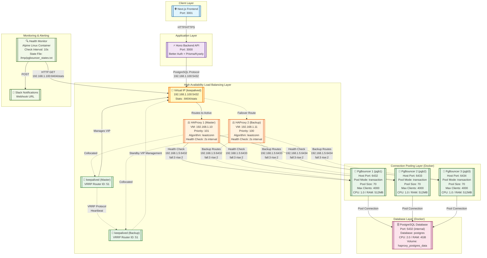

# System Architecture Diagram

```mermaid
graph TB
    subgraph "Client Layer"
        WEB[["🌐 Next.js Frontend<br/>Port: 3001"]]
    end

    subgraph "Application Layer"
        API[["⚡ Hono Backend API<br/>Port: 3000<br/>Better Auth + Prisma/Kysely"]]
    end

    subgraph "High Availability Load Balancing Layer"
        VIP[["🎯 Virtual IP (keepalived)<br/>192.168.1.100:5432<br/>Stats: :8404/stats"]]
        HAPROXY1[["⚖️ HAProxy 1 (Master)<br/>VM: 192.168.1.10<br/>Priority: 101<br/>Algorithm: leastconn<br/>Health Check: 2s interval"]]
        HAPROXY2[["⚖️ HAProxy 2 (Backup)<br/>VM: 192.168.1.11<br/>Priority: 100<br/>Algorithm: leastconn<br/>Health Check: 2s interval"]]
        KEEPALIVED1[["🔄 keepalived (Master)<br/>VRRP Router ID: 51"]]
        KEEPALIVED2[["🔄 keepalived (Backup)<br/>VRRP Router ID: 51"]]
    end

    subgraph "Connection Pooling Layer (Docker)"
        PGB1[["🔄 PgBouncer 1 (pgb1)<br/>Host Port: 6432<br/>Pool Mode: transaction<br/>Pool Size: 70<br/>Max Clients: 4000<br/>CPU: 1.0 / RAM: 512MB"]]
        PGB2[["🔄 PgBouncer 2 (pgb2)<br/>Host Port: 6433<br/>Pool Mode: transaction<br/>Pool Size: 70<br/>Max Clients: 4000<br/>CPU: 1.0 / RAM: 512MB"]]
        PGB3[["🔄 PgBouncer 3 (pgb3)<br/>Host Port: 6434<br/>Pool Mode: transaction<br/>Pool Size: 70<br/>Max Clients: 4000<br/>CPU: 1.0 / RAM: 512MB"]]
    end

    subgraph "Database Layer (Docker)"
        DB[["🗄️ PostgreSQL Database<br/>Port: 5432 (internal)<br/>Database: postgres<br/>CPU: 2.0 / RAM: 4GB<br/>Volume: haproxy_postgres_data"]]
    end

    subgraph "Monitoring & Alerting"
        MONITOR[["🔍 Health Monitor<br/>Alpine Linux Container<br/>Check Interval: 10s<br/>State File: /tmp/pgbouncer_states.txt"]]
        SLACK[["💬 Slack Notifications<br/>Webhook URL"]]
    end

    %% Client connections
    WEB -->|HTTP/HTTPS| API
    API -->|PostgreSQL Protocol<br/>192.168.1.100:5432| VIP

    %% Virtual IP routing to active HAProxy
    VIP -->|Routes to Active| HAPROXY1
    VIP -.->|Failover Route| HAPROXY2

    %% keepalived management
    KEEPALIVED1 -.->|VRRP Protocol<br/>Heartbeat| KEEPALIVED2
    KEEPALIVED1 -->|Manages VIP| VIP
    KEEPALIVED2 -.->|Standby VIP Management| VIP
    HAPROXY1 -.->|Collocated| KEEPALIVED1
    HAPROXY2 -.->|Collocated| KEEPALIVED2

    %% HAProxy routing to PgBouncer
    HAPROXY1 -->|Health Check<br/>192.168.1.5:6432<br/>fall:3 rise:2| PGB1
    HAPROXY1 -->|Health Check<br/>192.168.1.5:6433<br/>fall:3 rise:2| PGB2
    HAPROXY1 -->|Health Check<br/>192.168.1.5:6434<br/>fall:3 rise:2| PGB3
    
    HAPROXY2 -.->|Backup Routes<br/>192.168.1.5:6432<br/>fall:3 rise:2| PGB1
    HAPROXY2 -.->|Backup Routes<br/>192.168.1.5:6433<br/>fall:3 rise:2| PGB2
    HAPROXY2 -.->|Backup Routes<br/>192.168.1.5:6434<br/>fall:3 rise:2| PGB3
    
    %% PgBouncer to PostgreSQL
    PGB1 -->|Pool Connection| DB
    PGB2 -->|Pool Connection| DB
    PGB3 -->|Pool Connection| DB

    %% Monitoring connections
    MONITOR -->|HTTP GET<br/>192.168.1.100:8404/stats| VIP
    MONITOR -->|POST| SLACK

    %% Styling
    classDef client fill:#e1f5fe,stroke:#01579b,stroke-width:2px
    classDef app fill:#f3e5f5,stroke:#4a148c,stroke-width:2px
    classDef vip fill:#fff9c4,stroke:#f57f17,stroke-width:3px
    classDef lb fill:#fff3e0,stroke:#e65100,stroke-width:2px
    classDef keepalived fill:#e8f5e9,stroke:#2e7d32,stroke-width:2px
    classDef pool fill:#e8f5e9,stroke:#1b5e20,stroke-width:2px
    classDef db fill:#fce4ec,stroke:#880e4f,stroke-width:2px
    classDef monitor fill:#f1f8e9,stroke:#33691e,stroke-width:2px

    class WEB client;
    class API app;
    class VIP vip;
    class HAPROXY1,HAPROXY2 lb;
    class KEEPALIVED1,KEEPALIVED2 keepalived;
    class PGB1,PGB2,PGB3 pool;
    class DB db;
    class MONITOR,SLACK monitor;
```