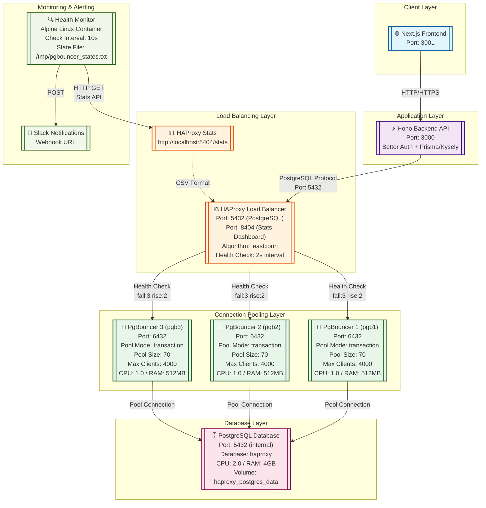

# System Architecture Diagram

```mermaid
graph TB
    subgraph "Client Layer"
        WEB[["🌐 Next.js Frontend<br/>Port: 3001"]]
    end

    subgraph "Application Layer"
        API[["⚡ Hono Backend API<br/>Port: 3000<br/>Better Auth + Prisma/Kysely"]]
    end

    subgraph "Load Balancing Layer"
        HAPROXY[["⚖️ HAProxy Load Balancer<br/>Port: 5432 (PostgreSQL)<br/>Port: 8404 (Stats Dashboard)<br/>Algorithm: leastconn<br/>Health Check: 2s interval"]]
        STATS[["📊 HAProxy Stats<br/>http://localhost:8404/stats"]]
    end

    subgraph "Connection Pooling Layer"
        PGB1[["🔄 PgBouncer 1 (pgb1)<br/>Port: 6432<br/>Pool Mode: transaction<br/>Pool Size: 70<br/>Max Clients: 4000<br/>CPU: 1.0 / RAM: 512MB"]]
        PGB2[["🔄 PgBouncer 2 (pgb2)<br/>Port: 6432<br/>Pool Mode: transaction<br/>Pool Size: 70<br/>Max Clients: 4000<br/>CPU: 1.0 / RAM: 512MB"]]
        PGB3[["🔄 PgBouncer 3 (pgb3)<br/>Port: 6432<br/>Pool Mode: transaction<br/>Pool Size: 70<br/>Max Clients: 4000<br/>CPU: 1.0 / RAM: 512MB"]]
    end

    subgraph "Database Layer"
        DB[["🗄️ PostgreSQL Database<br/>Port: 5432 (internal)<br/>Database: haproxy<br/>CPU: 2.0 / RAM: 4GB<br/>Volume: haproxy_postgres_data"]]
    end

    subgraph "Monitoring & Alerting"
        MONITOR[["🔍 Health Monitor<br/>Alpine Linux Container<br/>Check Interval: 10s<br/>State File: /tmp/pgbouncer_states.txt"]]
        SLACK[["💬 Slack Notifications<br/>Webhook URL"]]
    end

    %% Client connections
    WEB -->|HTTP/HTTPS| API
    API -->|PostgreSQL Protocol<br/>Port 5432| HAPROXY

    %% HAProxy routing
    HAPROXY -->|Health Check<br/>fall:3 rise:2| PGB1
    HAPROXY -->|Health Check<br/>fall:3 rise:2| PGB2
    HAPROXY -->|Health Check<br/>fall:3 rise:2| PGB3
    
    %% PgBouncer to PostgreSQL
    PGB1 -->|Pool Connection| DB
    PGB2 -->|Pool Connection| DB
    PGB3 -->|Pool Connection| DB

    %% Monitoring connections
    MONITOR -->|HTTP GET<br/>Stats API| STATS
    STATS -.->|CSV Format| HAPROXY
    MONITOR -->|POST| SLACK

    %% Styling
    classDef client fill:#e1f5fe,stroke:#01579b,stroke-width:2px
    classDef app fill:#f3e5f5,stroke:#4a148c,stroke-width:2px
    classDef lb fill:#fff3e0,stroke:#e65100,stroke-width:2px
    classDef pool fill:#e8f5e9,stroke:#1b5e20,stroke-width:2px
    classDef db fill:#fce4ec,stroke:#880e4f,stroke-width:2px
    classDef monitor fill:#f1f8e9,stroke:#33691e,stroke-width:2px

    class WEB client
    class API app
    class HAPROXY,STATS lb
    class PGB1,PGB2,PGB3 pool
    class DB db
    class MONITOR,SLACK monitor
```