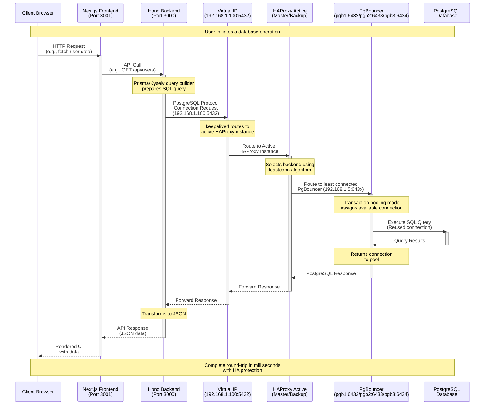
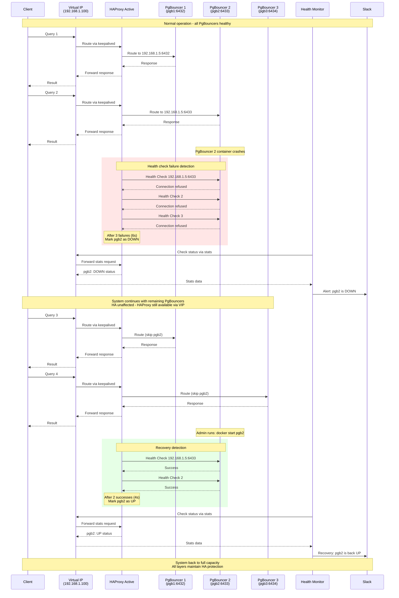
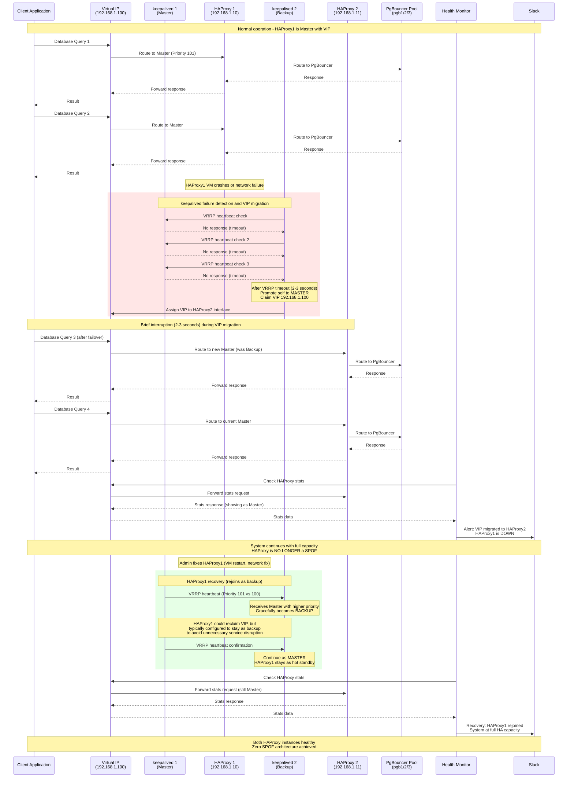
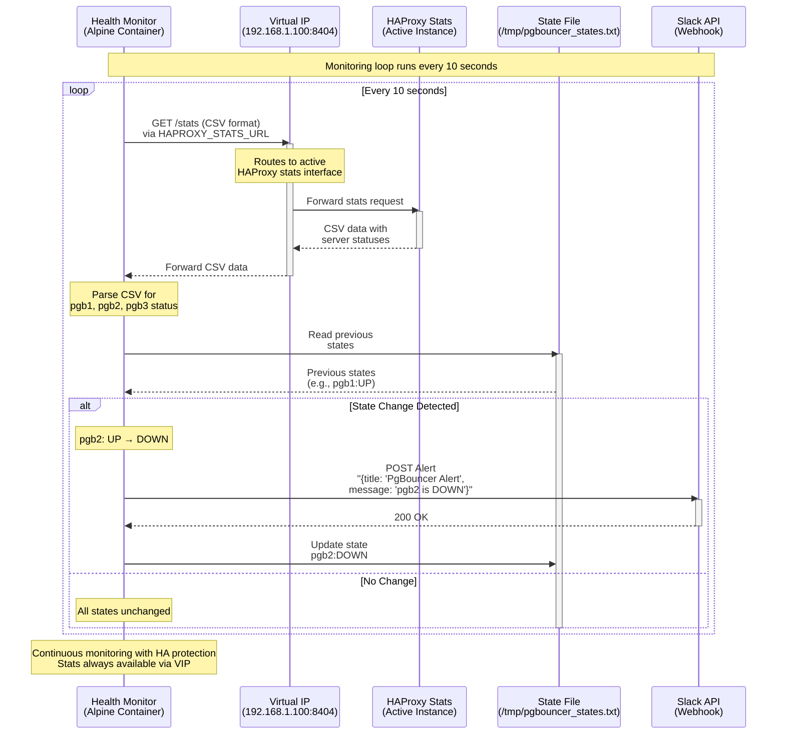

# System Sequence Diagrams

```mermaid
sequenceDiagram
    participant Client as Client Browser
    participant Next as Next.js Frontend<br/>(Port 3001)
    participant Hono as Hono Backend<br/>(Port 3000)
    participant VIP as Virtual IP<br/>(192.168.1.100:5432)
    participant HAProxy as HAProxy Active<br/>(Master/Backup)
    participant PGB as PgBouncer<br/>(pgb1:6432/pgb2:6433/pgb3:6434)
    participant DB as PostgreSQL<br/>Database

    Note over Client,DB: User initiates a database operation

    Client->>Next: HTTP Request<br/>(e.g., fetch user data)
    activate Next

    Next->>Hono: API Call<br/>(e.g., GET /api/users)
    activate Hono

    Note over Hono: Prisma/Kysely query builder<br/>prepares SQL query

    Hono->>VIP: PostgreSQL Protocol<br/>Connection Request<br/>(192.168.1.100:5432)
    activate VIP

    Note over VIP: keepalived routes to<br/>active HAProxy instance

    VIP->>HAProxy: Route to Active<br/>HAProxy Instance
    activate HAProxy

    Note over HAProxy: Selects backend using<br/>leastconn algorithm

    HAProxy->>PGB: Route to least connected<br/>PgBouncer (192.168.1.5:643x)
    activate PGB

    Note over PGB: Transaction pooling mode<br/>assigns available connection

    PGB->>DB: Execute SQL Query<br/>(Reused connection)
    activate DB

    DB-->>PGB: Query Results
    deactivate DB

    Note over PGB: Returns connection<br/>to pool

    PGB-->>HAProxy: PostgreSQL Response
    deactivate PGB

    HAProxy-->>VIP: Forward Response
    deactivate HAProxy

    VIP-->>Hono: Forward Response
    deactivate VIP

    Note over Hono: Transforms to JSON

    Hono-->>Next: API Response<br/>(JSON data)
    deactivate Hono

    Next-->>Client: Rendered UI<br/>with data
    deactivate Next

    Note over Client,DB: Complete round-trip in milliseconds<br/>with HA protection
```

## 2. PgBouncer Failover Scenario

```mermaid
sequenceDiagram
    participant Client as Client
    participant VIP as Virtual IP<br/>(192.168.1.100)
    participant HAProxy as HAProxy Active
    participant PGB1 as PgBouncer 1<br/>(pgb1:6432)
    participant PGB2 as PgBouncer 2<br/>(pgb2:6433)
    participant PGB3 as PgBouncer 3<br/>(pgb3:6434)
    participant Monitor as Health Monitor
    participant Slack as Slack

    Note over Client,Slack: Normal operation - all PgBouncers healthy

    Client->>VIP: Query 1
    VIP->>HAProxy: Route via keepalived
    HAProxy->>PGB1: Route to 192.168.1.5:6432
    PGB1-->>HAProxy: Response
    HAProxy-->>VIP: Forward response
    VIP-->>Client: Result

    Client->>VIP: Query 2
    VIP->>HAProxy: Route via keepalived
    HAProxy->>PGB2: Route to 192.168.1.5:6433
    PGB2-->>HAProxy: Response
    HAProxy-->>VIP: Forward response
    VIP-->>Client: Result

    Note over PGB2: PgBouncer 2 container crashes

    rect rgb(255, 230, 230)
        Note over HAProxy,PGB2: Health check failure detection

        HAProxy->>PGB2: Health Check 192.168.1.5:6433
        PGB2--xHAProxy: Connection refused

        HAProxy->>PGB2: Health Check 2
        PGB2--xHAProxy: Connection refused

        HAProxy->>PGB2: Health Check 3
        PGB2--xHAProxy: Connection refused

        Note over HAProxy: After 3 failures (6s)<br/>Mark pgb2 as DOWN
    end

    Monitor->>VIP: Check status via stats
    VIP->>HAProxy: Forward stats request
    HAProxy-->>VIP: pgb2: DOWN status
    VIP-->>Monitor: Stats data
    Monitor->>Slack: Alert: pgb2 is DOWN

    Note over Client,PGB3: System continues with remaining PgBouncers<br/>HA unaffected - HAProxy still available via VIP

    Client->>VIP: Query 3
    VIP->>HAProxy: Route via keepalived
    HAProxy->>PGB1: Route (skip pgb2)
    PGB1-->>HAProxy: Response
    HAProxy-->>VIP: Forward response
    VIP-->>Client: Result

    Client->>VIP: Query 4
    VIP->>HAProxy: Route via keepalived
    HAProxy->>PGB3: Route (skip pgb2)
    PGB3-->>HAProxy: Response
    HAProxy-->>VIP: Forward response
    VIP-->>Client: Result

    Note over PGB2: Admin runs: docker start pgb2

    rect rgb(230, 255, 230)
        Note over HAProxy,PGB2: Recovery detection

        HAProxy->>PGB2: Health Check 192.168.1.5:6433
        PGB2-->>HAProxy: Success

        HAProxy->>PGB2: Health Check 2
        PGB2-->>HAProxy: Success

        Note over HAProxy: After 2 successes (4s)<br/>Mark pgb2 as UP
    end

    Monitor->>VIP: Check status via stats
    VIP->>HAProxy: Forward stats request
    HAProxy-->>VIP: pgb2: UP status
    VIP-->>Monitor: Stats data
    Monitor->>Slack: Recovery: pgb2 is back UP

    Note over Client,Slack: System back to full capacity<br/>All layers maintain HA protection
```

## 3. HAProxy High Availability Failover

```mermaid
sequenceDiagram
    participant Client as Client Application
    participant VIP as Virtual IP<br/>(192.168.1.100)
    participant KeepAlive1 as keepalived 1<br/>(Master)
    participant HAProxy1 as HAProxy 1<br/>(192.168.1.10)
    participant KeepAlive2 as keepalived 2<br/>(Backup)
    participant HAProxy2 as HAProxy 2<br/>(192.168.1.11)
    participant PGB as PgBouncer Pool<br/>(pgb1/2/3)
    participant Monitor as Health Monitor
    participant Slack as Slack

    Note over Client,Slack: Normal operation - HAProxy1 is Master with VIP

    Client->>VIP: Database Query 1
    VIP->>HAProxy1: Route to Master (Priority 101)
    HAProxy1->>PGB: Route to PgBouncer
    PGB-->>HAProxy1: Response
    HAProxy1-->>VIP: Forward response
    VIP-->>Client: Result

    Client->>VIP: Database Query 2
    VIP->>HAProxy1: Route to Master
    HAProxy1->>PGB: Route to PgBouncer
    PGB-->>HAProxy1: Response
    HAProxy1-->>VIP: Forward response
    VIP-->>Client: Result

    Note over HAProxy1: HAProxy1 VM crashes or network failure

    rect rgb(255, 230, 230)
        Note over KeepAlive1,KeepAlive2: keepalived failure detection and VIP migration

        KeepAlive2->>KeepAlive1: VRRP heartbeat check
        KeepAlive1--xKeepAlive2: No response (timeout)

        KeepAlive2->>KeepAlive1: VRRP heartbeat check 2
        KeepAlive1--xKeepAlive2: No response (timeout)

        KeepAlive2->>KeepAlive1: VRRP heartbeat check 3
        KeepAlive1--xKeepAlive2: No response (timeout)

        Note over KeepAlive2: After VRRP timeout (2-3 seconds)<br/>Promote self to MASTER<br/>Claim VIP 192.168.1.100

        KeepAlive2->>VIP: Assign VIP to HAProxy2 interface
        activate HAProxy2
    end

    Note over Client,HAProxy2: Brief interruption (2-3 seconds) during VIP migration

    Client->>VIP: Database Query 3 (after failover)
    VIP->>HAProxy2: Route to new Master (was Backup)
    HAProxy2->>PGB: Route to PgBouncer
    PGB-->>HAProxy2: Response
    HAProxy2-->>VIP: Forward response
    VIP-->>Client: Result

    Client->>VIP: Database Query 4
    VIP->>HAProxy2: Route to current Master
    HAProxy2->>PGB: Route to PgBouncer
    PGB-->>HAProxy2: Response
    HAProxy2-->>VIP: Forward response
    VIP-->>Client: Result

    Monitor->>VIP: Check HAProxy stats
    VIP->>HAProxy2: Forward stats request
    HAProxy2-->>VIP: Stats response (showing as Master)
    VIP-->>Monitor: Stats data
    Monitor->>Slack: Alert: VIP migrated to HAProxy2<br/>HAProxy1 is DOWN

    Note over Client,Slack: System continues with full capacity<br/>HAProxy is NO LONGER a SPOF

    Note over HAProxy1: Admin fixes HAProxy1 (VM restart, network fix)

    rect rgb(230, 255, 230)
        Note over KeepAlive1,KeepAlive2: HAProxy1 recovery (rejoins as backup)

        KeepAlive1->>KeepAlive2: VRRP heartbeat (Priority 101 vs 100)
        Note over KeepAlive2: Receives Master with higher priority<br/>Gracefully becomes BACKUP

        Note over KeepAlive1,KeepAlive2: HAProxy1 could reclaim VIP, but<br/>typically configured to stay as backup<br/>to avoid unnecessary service disruption

        KeepAlive1->>KeepAlive2: VRRP heartbeat confirmation
        Note over KeepAlive2: Continue as MASTER<br/>HAProxy1 stays as hot standby
    end

    Monitor->>VIP: Check HAProxy stats
    VIP->>HAProxy2: Forward stats request (still Master)
    HAProxy2-->>VIP: Stats response
    VIP-->>Monitor: Stats data
    Monitor->>Slack: Recovery: HAProxy1 rejoined<br/>System at full HA capacity

    Note over Client,Slack: Both HAProxy instances healthy<br/>Zero SPOF architecture achieved
```

## 4. Health Monitoring & Alerting Flow

```mermaid
sequenceDiagram
    participant Monitor as Health Monitor<br/>(Alpine Container)
    participant VIP as Virtual IP<br/>(192.168.1.100:8404)
    participant HAStats as HAProxy Stats<br/>(Active Instance)
    participant StateFile as State File<br/>(/tmp/pgbouncer_states.txt)
    participant Slack as Slack API<br/>(Webhook)

    Note over Monitor,Slack: Monitoring loop runs every 10 seconds

    loop Every 10 seconds
        Monitor->>VIP: GET /stats (CSV format)<br/>via HAPROXY_STATS_URL
        activate VIP

        Note over VIP: Routes to active<br/>HAProxy stats interface

        VIP->>HAStats: Forward stats request
        activate HAStats

        HAStats-->>VIP: CSV data with<br/>server statuses
        deactivate HAStats

        VIP-->>Monitor: Forward CSV data
        deactivate VIP

        Note over Monitor: Parse CSV for<br/>pgb1, pgb2, pgb3 status

        Monitor->>StateFile: Read previous<br/>states
        activate StateFile

        StateFile-->>Monitor: Previous states<br/>(e.g., pgb1:UP)

        alt State Change Detected
            Note over Monitor: pgb2: UP → DOWN

            Monitor->>Slack: POST Alert<br/>"{title: 'PgBouncer Alert',<br/>message: 'pgb2 is DOWN'}"
            activate Slack

            Slack-->>Monitor: 200 OK
            deactivate Slack

            Monitor->>StateFile: Update state<br/>pgb2:DOWN

        else No Change
            Note over Monitor: All states unchanged
        end

        deactivate StateFile
    end

    Note over Monitor: Continuous monitoring with HA protection<br/>Stats always available via VIP
```
