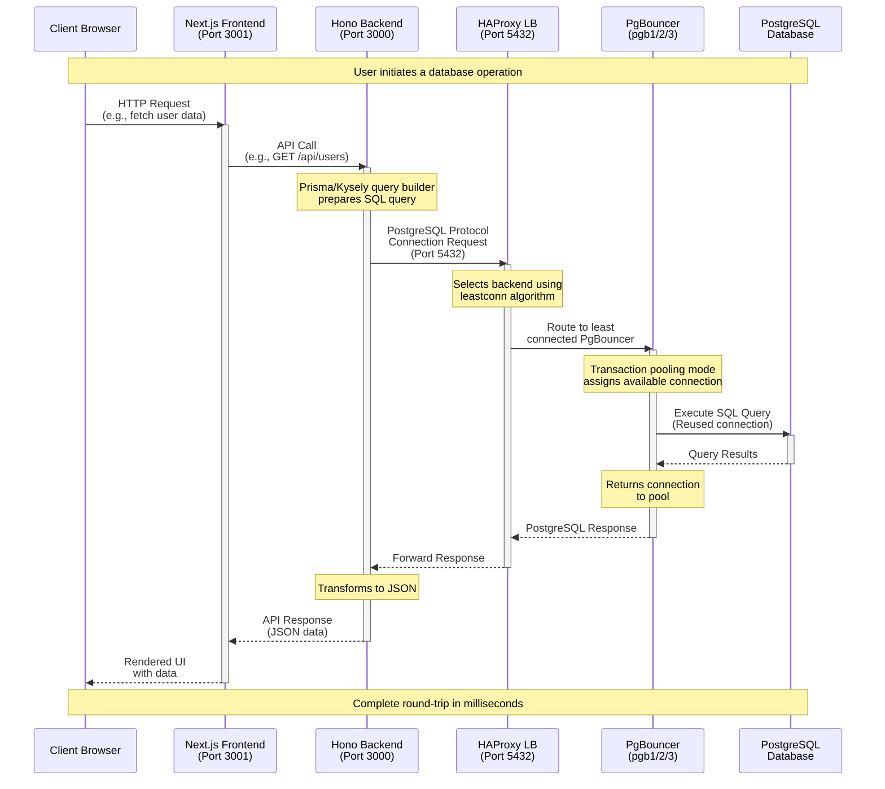
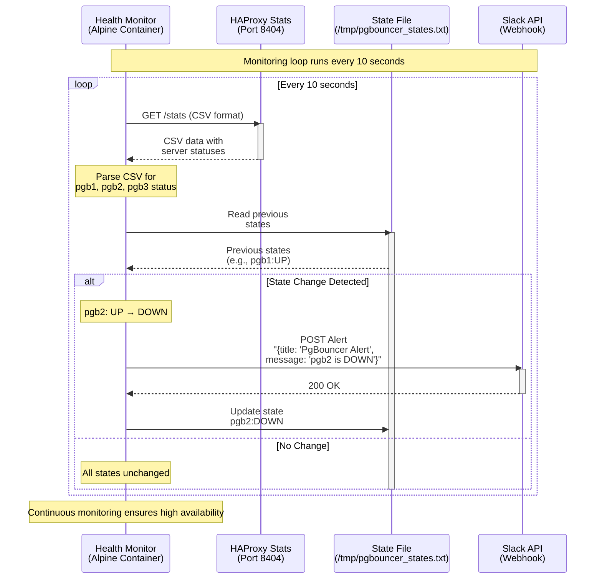
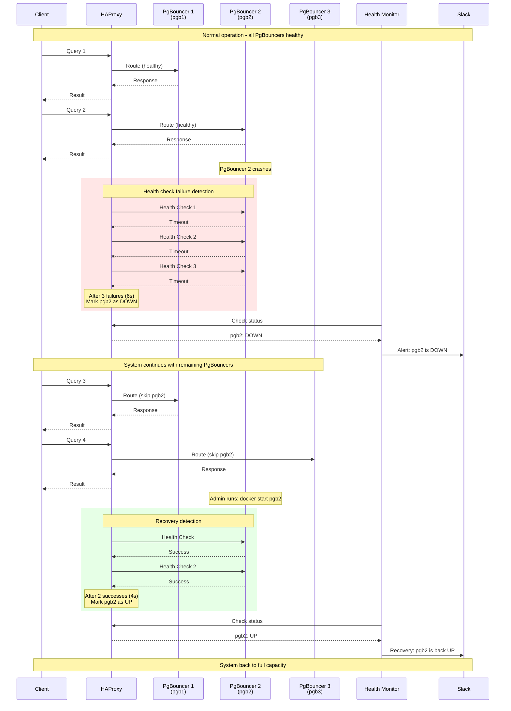

# System Sequence Diagrams

```mermaid
sequenceDiagram
    participant Client as Client Browser
    participant Next as Next.js Frontend<br/>(Port 3001)
    participant Hono as Hono Backend<br/>(Port 3000)
    participant HAProxy as HAProxy LB<br/>(Port 5432)
    participant PGB as PgBouncer<br/>(pgb1/2/3)
    participant DB as PostgreSQL<br/>Database

    Note over Client,DB: User initiates a database operation

    Client->>Next: HTTP Request<br/>(e.g., fetch user data)
    activate Next
    
    Next->>Hono: API Call<br/>(e.g., GET /api/users)
    activate Hono
    
    Note over Hono: Prisma/Kysely query builder<br/>prepares SQL query

    Hono->>HAProxy: PostgreSQL Protocol<br/>Connection Request<br/>(Port 5432)
    activate HAProxy
    
    Note over HAProxy: Selects backend using<br/>leastconn algorithm

    HAProxy->>PGB: Route to least<br/>connected PgBouncer
    activate PGB
    
    Note over PGB: Transaction pooling mode<br/>assigns available connection

    PGB->>DB: Execute SQL Query<br/>(Reused connection)
    activate DB
    
    DB-->>PGB: Query Results
    deactivate DB
    
    Note over PGB: Returns connection<br/>to pool

    PGB-->>HAProxy: PostgreSQL Response
    deactivate PGB
    
    HAProxy-->>Hono: Forward Response
    deactivate HAProxy
    
    Note over Hono: Transforms to JSON

    Hono-->>Next: API Response<br/>(JSON data)
    deactivate Hono
    
    Next-->>Client: Rendered UI<br/>with data
    deactivate Next

    Note over Client,DB: Complete round-trip in milliseconds
```

## 2. Health Monitoring & Alerting Flow

```mermaid
sequenceDiagram
    participant Monitor as Health Monitor<br/>(Alpine Container)
    participant HAStats as HAProxy Stats<br/>(Port 8404)
    participant StateFile as State File<br/>(/tmp/pgbouncer_states.txt)
    participant Slack as Slack API<br/>(Webhook)

    Note over Monitor,Slack: Monitoring loop runs every 10 seconds

    loop Every 10 seconds
        Monitor->>HAStats: GET /stats (CSV format)
        activate HAStats
        
        HAStats-->>Monitor: CSV data with<br/>server statuses
        deactivate HAStats
        
        Note over Monitor: Parse CSV for<br/>pgb1, pgb2, pgb3 status

        Monitor->>StateFile: Read previous<br/>states
        activate StateFile
        
        StateFile-->>Monitor: Previous states<br/>(e.g., pgb1:UP)
        
        alt State Change Detected
            Note over Monitor: pgb2: UP → DOWN
            
            Monitor->>Slack: POST Alert<br/>"{title: 'PgBouncer Alert',<br/>message: 'pgb2 is DOWN'}"
            activate Slack
            
            Slack-->>Monitor: 200 OK
            deactivate Slack
            
            Monitor->>StateFile: Update state<br/>pgb2:DOWN
            
        else No Change
            Note over Monitor: All states unchanged
        end
        
        deactivate StateFile
    end

    Note over Monitor: Continuous monitoring ensures high availability
```

## 3. PgBouncer Failover Scenario

```mermaid
sequenceDiagram
    participant Client as Client
    participant HAProxy as HAProxy
    participant PGB1 as PgBouncer 1<br/>(pgb1)
    participant PGB2 as PgBouncer 2<br/>(pgb2)
    participant PGB3 as PgBouncer 3<br/>(pgb3)
    participant Monitor as Health Monitor
    participant Slack as Slack

    Note over Client,Slack: Normal operation - all PgBouncers healthy

    Client->>HAProxy: Query 1
    HAProxy->>PGB1: Route (healthy)
    PGB1-->>HAProxy: Response
    HAProxy-->>Client: Result

    Client->>HAProxy: Query 2
    HAProxy->>PGB2: Route (healthy)
    PGB2-->>HAProxy: Response
    HAProxy-->>Client: Result

    Note over PGB2: PgBouncer 2 crashes

    rect rgb(255, 230, 230)
        Note over HAProxy,PGB2: Health check failure detection
        
        HAProxy->>PGB2: Health Check 1
        PGB2--xHAProxy: Timeout
        
        HAProxy->>PGB2: Health Check 2
        PGB2--xHAProxy: Timeout
        
        HAProxy->>PGB2: Health Check 3
        PGB2--xHAProxy: Timeout
        
        Note over HAProxy: After 3 failures (6s)<br/>Mark pgb2 as DOWN
    end

    Monitor->>HAProxy: Check status
    HAProxy-->>Monitor: pgb2: DOWN
    Monitor->>Slack: Alert: pgb2 is DOWN

    Note over Client,PGB3: System continues with remaining PgBouncers

    Client->>HAProxy: Query 3
    HAProxy->>PGB1: Route (skip pgb2)
    PGB1-->>HAProxy: Response
    HAProxy-->>Client: Result

    Client->>HAProxy: Query 4
    HAProxy->>PGB3: Route (skip pgb2)
    PGB3-->>HAProxy: Response
    HAProxy-->>Client: Result

    Note over PGB2: Admin runs: docker start pgb2

    rect rgb(230, 255, 230)
        Note over HAProxy,PGB2: Recovery detection
        
        HAProxy->>PGB2: Health Check
        PGB2-->>HAProxy: Success
        
        HAProxy->>PGB2: Health Check 2
        PGB2-->>HAProxy: Success
        
        Note over HAProxy: After 2 successes (4s)<br/>Mark pgb2 as UP
    end

    Monitor->>HAProxy: Check status
    HAProxy-->>Monitor: pgb2: UP
    Monitor->>Slack: Recovery: pgb2 is back UP

    Note over Client,Slack: System back to full capacity
```